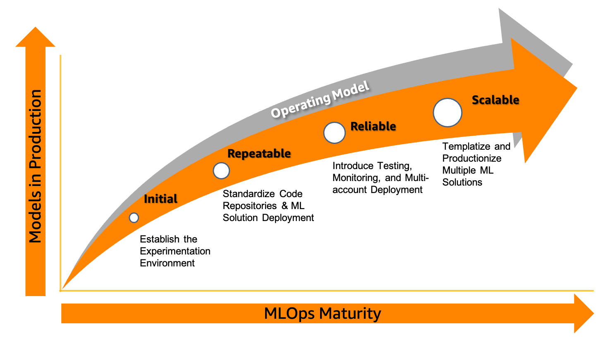

# MLOps labs

## Introduction

Building an MLOps foundation that can cover the operations, people, and technology needs of 
enterprise customers is challenging. Therefore, we define the following maturity model 
that defines the necessary capabilities of MLOps in four key phases.

Each stage represents practices that align to the increased adoption of MLOps 
practices to move from a project or repeatable stage to adopting ML workloads 
at scale. Check this [Blog Post](https://aws.amazon.com/blogs/machine-learning/mlops-foundation-roadmap-for-enterprises-with-amazon-sagemaker/)
for further details on the MLOps Foundations Roadmap for Enterprises on Amazon SageMaker.

Today, we will cover the **Initial** and **Repeatable** stages of the process: 

In the Initial stage, you begin to incorporate ML projects into your overall strategy to 
drive business outcomes. At this stage, the Machine Learning Development Cycle (MLDC) 
typically involves a lot of manual hand-offs and processes. For example, the data engineer 
manually hands off the data to the data scientists. The data scientists manually hand off 
their model to the deployment team which can consist of DevOps or MLOps engineers.

In this Initial stage, you might have or will have multiple models running in production with 
manual handoffs and processes and that starts to become very cumbersome. 
So there becomes a need to increase the level of automation to ensure the deployments are 
repeatable. 

This is where we move to the Repeatable stage where we automate most handoffs by orchestrating 
each step of the MLDC together.

You'll walk through three hands-on labs. Please note that the labs are directly copied from https://github.com/aws-samples/mlops-amazon-sagemaker/tree/master/mlops-roadshow.
* Lab 1: data preparation
* Lab 2: model training
* Lab 3: model deployment

# Prerequisites
* Open the AWS Console and Amazon SageMaker. 
* Open the SageMaker Studio. Click "File" -> "New" -> "Terminal".
* In the terminal, git clone https://github.com/qzhangSpark/mlops-distributed-training-labs.git
* In the SageMaker Studio, click the File Browser on the left menu and navigate to the **sagemaker-mlops-labs** folder
* For all labs, select "Data Science" image and "Python 3" Kernel for Notebooks.
